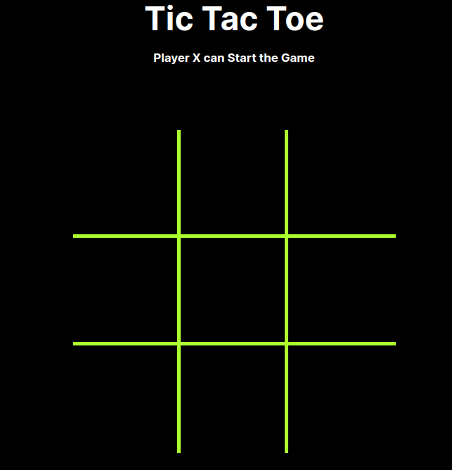
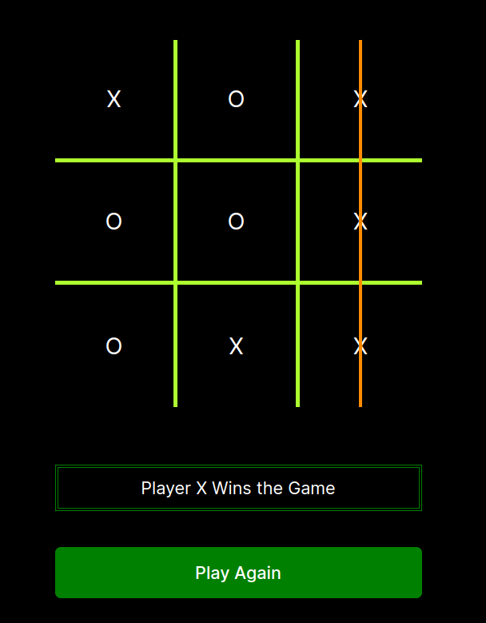
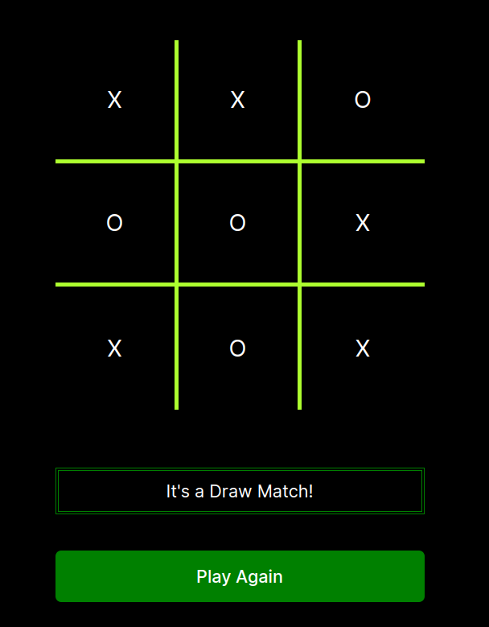

# Tic-Tac-Toe Game

A Game where Players take turns placing a mark in one of the cells of the grid. The goal of the game is for players to position their marks so that they make a continuous line of three cells vertically, horizontally, or diagonally. An opponent can prevent a win by blocking the completion of the opponent's line.


### Tech Stack

- React.JS
- TypeScript
- HTML
- CSS 


### Features

- Multiplayer
- Real Time 
- Restart Game


### Screenshots










## Run Locally

Clone the project

```bash
  git clone https://github.com/neeraj-gs/TicTac-Toe.git
```

Go to the project directory

```bash
  cd tic-tac-toe-typescript
```

Install dependencies

```bash
  npm install
```

Start the server

```bash
  npm run dev
```

Project is Setup locally done.
## Deployment

The Project is Deployed on 

```bash
  https://tic-tac-toe-eta-olive.vercel.app/
```

